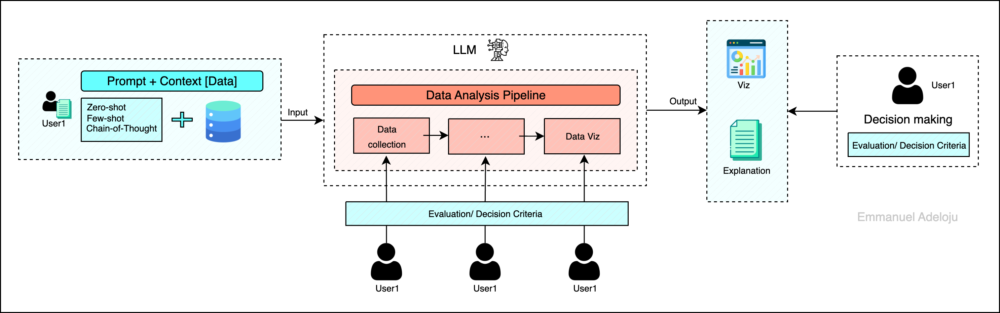

# Welcome to my homepage ;)

It is crazy considering how I got into AI research. From teaching high school mathematics, chemistry, and biology, to earning a BSc in Biochemistry, publishing empirical toxicology research, and co-authoring a chapter in a food biochemistry book, to conducting research in forensic hematoglogy during my MSc in Cell Biology and Genetics (Molecular Biology) and now to investigating how artificial intelligence transforms learning, my journey seems unconventional. But as Steve Jobs said, "the people who are crazy enough to think they can change the world, are the ones who do."

I am Emmanuel Adeloju, a third-year PhD student in the Learning Literacies and Technologies program at Arizona State University, where I am advised by Dr. Michelle Jordan and Dr. Punya Mishra. My research examines how K-12 science teachers develop expertise in facilitating student data sensemaking when using Large Language Models (LLMs), a question at the intersection of teacher learning, science education, and human-AI collaboration.

Through mixed-methods research grounded in TPACK and reflective practice frameworks, I investigate how teachers' technological, pedagogical, and content knowledge evolves as they learn to integrate LLMs into authentic classroom contexts. My dissertation employs comparative case study methodology to trace teachers' learning trajectories from initial engagement with AI tools through collaborative lesson design to classroom implementation, examining what experiences shape their reflective practice and instructional decision-making.

This work bridges learning sciences, human-computer interaction, and AI evaluation research. I am also interested in how the interpretability and explainability of AI systems, central concerns in my ongoing research on XAI for machine learning/LLM predictions, directly impact teachers' capacity to support meaningful student data sensemaking. My technical work auditing the faithfulness of LLM-generated explanations informs my understanding of what teachers need from AI systems to facilitate trustworthy, pedagogically sound data investigations.

Beyond my dissertation, I have conducted research on machine learning for data validation in an agriphotovoltaics project, contributed to food biochemistry texbook, and supported graduate instruction in statistical analysis and data science methods. My broader research agenda focuses on designing and evaluating human-centered AI systems that are responsive to educators' expertise, align with pedagogical values, and support equitable learning opportunities in data-rich science classrooms.

My trajectory, from biochemistry laboratories to science classrooms to education and human-centered AI research, has taught me one fundamental lesson: I can learn anything and adapt to any uncharted challenge.

---

## Education

**PhD, Learning Literacies and Technology** | *Expected May 2027*  
Arizona State University, USA  
Advisors: Dr. Michelle Jordan | Dr. Punya Mishra  
- Dissertation research: Human-AI collaboration, AI evaluation in educational contexts, teacher-AI interaction design, LLM usability

**MSc, Cell Biology and Genetics** | *2021 - 2022*  
University of Lagos, Nigeria

**Postgraduate Diploma in Education** | *2018 - 2019*  
National Teachers Institute Kaduna, Nigeria

**BSc, Biochemistry** | *2012 - 2016*  
Osun State University, Nigeria

---

## Technical Skills

- **Research Methods:** Mixed methods research design, usability testing, contextual inquiry, survey design and validation, experimental design, statistical analysis, LLM evaluations and metrics, thematic analysis, comparative case studies

- **Data Analysis & ML:** Python (Pandas, NumPy, Matplotlib, Seaborn, TensorFlow, PyTorch), R, SPSS, statistical modeling, machine learning for data validation, linear regression, multivariate analysis

- **Development:** HTML, CSS, Figma, data visualization, survey instrument design

---

## Ongoing Project

[**Adeloju, E.** (2025). *LLM-mediated data sensemaking: Exploring teachers' reflective practice in AI-supported science learning.* [Manuscript in preparation].](https://prodholly.github.io/emmanuel-adeloju.github.io/research/)

---

## Research Experience

### Ongoing Dissertation Research: LLM for Data Sensemaking in K-12 Education
- Designing and conducting a longitudinal mixed-methods study on LLM use for data sensemaking in K-12 education, including user research, surveys, co-design sessions, and LLM output evaluation to examine trust, usability, interpretability, and human-AI collaboration.
- Developing AI evaluation methodology and validation protocols translating domain expert insights into performance criteria, aligned with the TPACK framework, to inform facilitation strategies.

### Program and Research Data Analyst
*Arizona State University & UL Research Institutes | 2024–Present*
- Designed and validated survey instruments for formative and summative evaluation
- Analyzed quantitative survey data using R and SPSS
- Conducted qualitative analysis of teacher reflections and interviews
- Authored evaluation reports and presented findings at national conferences

### STEM Education Researcher and Mentor – Agrivoltaics Integration in K–12 Sustainability Projects
*Arizona State University | 2023–Present*
- Developed ML models to validate student-collected environmental data
- Conducted user research through site visits observing student-technology interactions
- Designed instructional materials and co-design workshops with teachers

### Student Navigation of Science Information on Social Media
*Arizona State University | 2023–2024*
- Designed high-fidelity Figma prototypes for usability studies and created stimuli simulating misinformation content

---

## Teaching Experience

### Teaching Assistant – COE 502: Introduction to Data Analysis
*Arizona State University | Spring 2025*
- Supported graduate-level instruction and delivered labs on statistics
- Graded assignments and offer feedback

### Instructor of Record – SCN 208: Nature and Society
*Arizona State University*
- Developed and delivered curriculum on scientific thinking and environmental systems
- Designed assessments emphasizing application of scientific inquiry
- Mentored students in evidence-based reasoning

---

## Selected Awards

### 2025 Mary Lou Fulton Endowment Scholarship (MLFC Travel Award)
- Awarded to support travel and presentation at a conference of choice

### Graduate Support Award (2025)
- Granted in recognition of remarkable dedication and invaluable contributions as a
member of the ASU community

---

## Selected Publications & Presentations

(Other published work and conference presentations will be added on a dedicated page soon)

**Adeloju, E.**, Jordan, M., & Meza-Torres, C. (2025, February 21). Machine Learning for Validating Citizen Science Data: A Case Study with High School Students in Agri-Photovoltaics Project in the Sonoran Desert Region [Conference presentation]. The Doctoral Council at the Teachers College (TCDC) Conference, Tempe, AZ, United States.

Meza-Torres, C., & **Adeloju, E**. (2025, April 23-27). Reimagining School-based Citizen Science for Sustainable Futures: K-12 teachers fostering visibility, believability, and meaningfulness [Conference presentation]. In Weinberg, A. (chair), Education for Imagining and Advancing Preferred Planetary Futures. AERA Conference Denver, CO, United States.

Jordan, M., Weinberg, A., **Adeloju, E.**, & Oster, N. (2024, Nov). Formative Assessment Report #2. ULRI Annual Research Symposium, Atlanta, GA.

Meza-Torres, C., Jordan, M., Zuiker, S., Jongewaard, R., **Adeloju, E.**, & Spreitzer, K. (2024, June). Examining Teacher Supports for Visibility, Believability, and Meaningfulness in Place-Based Citizen Science. In Proceedings of the 18th International Conference of the Learning Sciences-ICLS 2024 Proceedings.

Ajayi, E. I., Molehin, O. R., Ajayi, O. O., **Adeloju, E. O.**, & Oladele, J. O. (2023). Application of chitosan-coated foods, fruits and vegetables on inflammation in metabesity. In Next Generation Nanochitosan (pp. 431-446). Academic Press.

Oladele, J., Oyewole, O. I., Oyeleke, M. O., Adewale, O. O., & **Adeloju, O. E**. (2019). Annona muricata attenuates cadmium-induced oxidative stress and renal toxicity in Wistar rats. Journal of Bioscience and Applied Research, 5(4), 543-550.

---

## Latest Coursework

**EE 549: Statistical Machine Learning – Theory to Practice**  
Supervised learning (classification, regression, SVM, k-NN), unsupervised learning (k-means, EM), reinforcement learning (Q-learning, deep Q-networks), experimental design, model evaluation

**PAF 513: Foundations of Data Science** (in R programming)

**COE 502: Introduction to Data Analysis**

---

## Let's Connect!

I'm always interested in discussing human-centered AI, LLM evaluation, and education research. Feel free to reach out!
